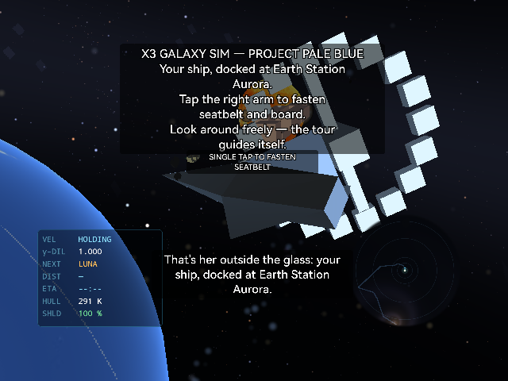
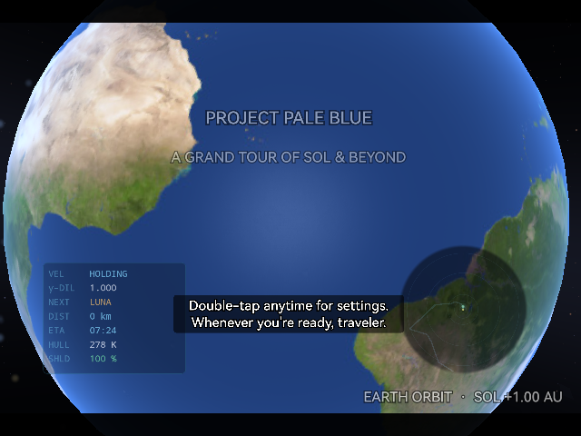

# X3GalaxySim

X3GalaxySim is a stereoscopic, on-rails science tour for the RayNeo X3 Pro AR glasses, carrying the viewer from Earth orbit through the Solar System and onward into the wider galaxy over roughly an hour. The simulation favors scientific context over arcade fantasy: real Solar System textures, a star-catalog backdrop, telemetry readouts (velocity, Lorentz factor, distance, ETA), and point-of-interest narration that touches on astronomy, spaceflight history, and humanity's path toward a Kardashev Type I future, in the spirit of Carl Sagan's "pale blue dot" perspective. Because the X3 Pro's waveguide display can only add light rather than subtract it, every planet is rendered with lighting that swings toward the camera to keep its lit, textured face in view — a deliberate departure from strict day/night physics that keeps distant worlds visible rather than rendering as holes in the sky. Viewers can jump directly to any stop on the tour, with the ship making a visible light-speed run to the new segment instead of teleporting.

## Screenshots

  
  

## Demo

## Controls

- Gaze (3DoF head tracking) — look around the cabin and scene
- Settings menu — jump to any tour segment, adjust subtitles and audio mix
- Triple-tap — recalibrate head tracking and recenter the camera

## Download

The debug APK is published as a GitHub release asset (too large for the repo itself): [X3GalaxySim-debug.apk](https://github.com/tropicalstream/X3GalaxySim/releases/download/v0.1.1/X3GalaxySim-debug.apk)
